# PEMP Engagement State Machine

The enforced engagement lifecycle — the **core of the product** (CLAUDE.md: "treat
guard logic as a correctness requirement, not a nicety"). Each transition unlocks
**only** when its guard is satisfied; every transition writes a hash-chained audit
entry (`SEC-AUD-01`, `FR-AUD-02`). This is the contract between the UI spine
(DESIGN_PLAN §1.1), the backend state machine, and the SRS guard table (DESIGN_PLAN §8).

```mermaid
stateDiagram-v2
    direction LR
    [*] --> Intake

    Intake --> Assignment: request routed to DM queue<br/>(FR-REQ-03)
    Assignment --> Scoping: ≥1 tester assigned<br/>(FR-ASG-03)
    Scoping --> SoW: assessment complete<br/>(FR-SCO-03)

    state SoW {
        direction LR
        [*] --> Drafting
        Drafting --> DMReview: PROJECT path<br/>(FR-SOW-03)
        Drafting --> IssuedBAU: BAU path — issue direct<br/>(FR-SOW-04)
        DMReview --> AwaitSign: DM approved
        IssuedBAU --> AwaitSign
        AwaitSign --> [*]: SoW SIGNED<br/>(FR-SOW-05/06)
    }

    SoW --> Access: 🔒 GATE — SoW signed<br/>(FR-SOW-06)
    Access --> Execution: 🔒 GATE — access verified<br/>before start (FR-ACC-04)
    Execution --> Findings: IR notice sent (FR-EXE-01)<br/>end-of-test + summary (FR-EXE-03/04)
    Findings --> Report: draft generated<br/>from findings (FR-REP-01)
    Report --> FinalReport: 🔒 GATE — peer QA<br/>review passed (FR-REP-02)
    FinalReport --> Closed: final report + register<br/>stored immutable (FR-REP-04, FR-DOC-02)

    Closed --> Retest: retest requested vs<br/>remediated findings (FR-RET-01)
    Retest --> [*]: spawns child engagement<br/>(FR-RET-02)

    Closed --> [*]
```

## Guard table (authoritative)

| # | Transition | Guard (FR) | Owner | While locked (UI) |
|---|-----------|------------|-------|-------------------|
| 1 | → Intake | fields complete + ref minted (`FR-REQ-01/04`) | Acme CA | submit disabled |
| 2 | Intake → Assignment | routed to DM queue (`FR-REQ-03`) | DM | "Waiting on Delivery Manager" |
| 3 | Assignment → Scoping | ≥1 tester assigned (`FR-ASG-03`) | Tester | 🔒 "Awaiting tester assignment" |
| 4 | Scoping → SoW | assessment complete (`FR-SCO-03`) | Tester | 🔒 "Assessment N% — finish to draft SoW" |
| 5 | **SoW → Access** | **SoW signed** (`FR-SOW-05/06`); Project: DM-review→Acme-sign (`FR-SOW-03`); BAU: issued (`FR-SOW-04`) | Acme CA | 🔒 **"Locked — needs signed SoW"** |
| 6 | Access → Execution | access verified before start (`FR-ACC-04`) | Tester | 🔒 "Verify access to start" + ticket ages |
| 7 | Execution start | IR advance notice sent (`FR-EXE-01`) | Tester | "Send IR notice to begin" |
| 8 | Execution → Findings | end-of-test (`FR-EXE-03`) + summary same day (`FR-EXE-04`) | Tester | counts up days in window |
| 9 | Findings → Report | draft generated (`FR-REP-01`) | Tester | 🔒 "Add findings to draft report" |
| 10 | Report → Final | **peer QA review passed** (`FR-REP-02`) | Peer tester | 🔒 "Awaiting QA peer review" |
| 11 | Final → Closed | final report + register stored (`FR-REP-04`, `FR-DOC-02` immutable) | Tester | "Releasing…" (async, `NFR-PER-03`) |
| 12 | Closed → Retest (child) | retest requested (`FR-RET-01`) → child (`FR-RET-02`) | Stakeholder/Acme | "Request retest" on closed |

## Invariants (enforced server-side, not just in the UI)

- **No skipping.** A transition is rejected unless the *current* state matches and
  the guard predicate is true. The UI spine reflects state; it never authorises it.
- **Atomic transition + audit.** State change and hash-chain append (`SEC-AUD-01`)
  commit in one transaction — the chain is never left half-written (DESIGN_PLAN §10
  error path). Reassignments (`FR-ASG-05`) and SoW re-versions (`FR-SOW-02`) are
  logged without leaving the stage.
- **Object-level authorisation on every transition** (`SEC-AZN-02`): the actor must
  own the guard for *this* engagement under RBAC + engagement isolation (`SEC-AZN-03`).
  Testers act only on assigned engagements (`SEC-INS-01`).
- **Re-auth on privileged transitions** (`SEC-IAM-04`): sign-off, access-verify,
  report-release each require fresh Entra MFA before commit.
- **Retest is a child engagement** with its own state machine, linked to the parent
  (`FR-RET-02`), re-verifying only in-scope findings (pass/fail each).
